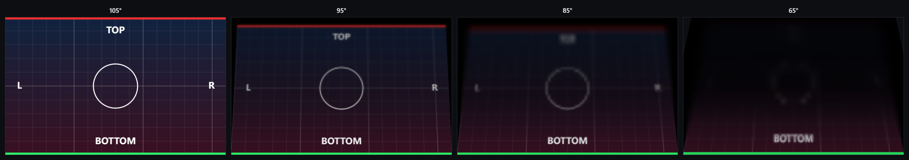
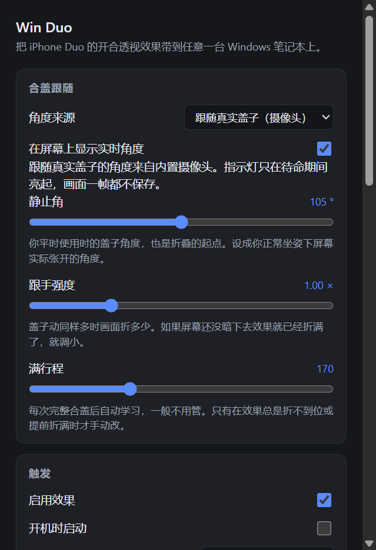

# Win Duo

**The iPhone Duo fold effect, on any Windows laptop — following the real lid, with no hinge sensor.**

[English](#english) · [简体中文](#简体中文)



*Rendered by `npm run selftest` — 105°, 95°, 85° and 65°, the window a laptop flat on a desk actually shows.*

---

## English

### What it is

When Apple shipped the iPhone Duo, the thing people copied was not the hinge — it was the
animation. As the screen folds, the content does not just disappear behind the crease: it
tilts away in perspective, blurs and dims as it recedes, so it reads as one continuous
object moving in a room rather than a panel switching off.

**Win Duo puts that animation on a Windows laptop, and drives it from the real lid.** Press a
hotkey to arm it, then close the lid: your actual desktop — whatever is on screen at that
moment — tilts, blurs and darkens in step with your hand. Stop moving and it holds. Open the
lid and it unfolds back. Let go and the screen is handed back untouched.

The whole app is about 3,000 lines of JavaScript, and the effect itself is seven files
totalling roughly 1,250. No native modules, no compiler, no Visual Studio, no administrator
rights. Every pixel is computed by one fragment shader.

### The honest bit

Mac Duo, the reference implementation for macOS, reads a real **lid angle sensor**: an Apple
`AppleSPUHIDDevice` (HID usage page `0x20`, usage `0x8A`) that reports the hinge angle
0–360° at roughly 10 Hz.

**A normal Windows laptop has nothing equivalent.** Windows does have a hinge angle API,
but [`Windows.Devices.Sensors.HingeAngleSensor`][hinge] is documented as *"the hinge angle
sensor in a **dual-screen device**"* — it exists for Surface Duo and Neo class hardware. On a
consumer laptop there is no hinge sensor at all; the lid is a binary hall switch that reports
open or shut and nothing in between.

I checked a real one rather than trusting the docs: probing all fourteen
`Windows.Devices.Sensors` classes on this machine returns **zero** sensors of any kind. No
hinge angle, no accelerometer, no ambient light sensor.

So the angle has to come from somewhere else, and it has to come from something that exists
on every machine. It comes from the webcam.

### How the angle is read

> Every laptop's webcam is rigidly fixed to the lid. Rotating the lid by Δθ rotates the camera
> by Δθ, and the whole scene slides across the frame by about f·tan(Δθ) — roughly **nine pixels
> per degree** at 640 px wide and a 60° field of view.

That is geometry, not luck. It holds regardless of headphones, cabling, room lighting or which
Wi-Fi network you are on, which is why it is the one signal worth building on. Three other
candidates were measured and rejected:

| Signal | Why it is not usable |
| --- | --- |
| Ambient light sensor | Most laptops do not have one. This one does not. |
| Speaker → microphone | The 3.5 mm jack physically disconnects the internal speakers, so anyone wearing headphones kills it. |
| Wi-Fi RSSI | Needs a live association and an antenna in the lid, and multipath makes it non-monotonic. |

The hard part is not the geometry, it is that **the person closing the lid is also in the
frame, moving more than the lid does.** The tracker handles it like this:

1. The frame is reduced to 160×120 and cut into **eight vertical strips**.
2. Each strip is correlated on its own, and the **median** of the eight is taken. A hand or a
   head only corrupts the strips it covers; a mean would be dragged by them.
3. Strips that are too flat to correlate (a blank wall, a dark ceiling) or too uncertain are
   dropped outright.
4. A **deadband** discards movement below correlation noise, so the angle cannot creep while
   the lid is held still.
5. The **sign is not assumed.** Which way the scene slides depends on how the camera is
   mounted and how the user sits, so it is latched from the largest excursion of the run. A
   bigger movement the other way re-latches it.
6. How much travel a complete close produces is **re-learned from every complete close**,
   because it depends on the camera, the room and the seating position.
7. The tracker is **re-zeroed on every arm**, so drift between runs never accumulates.

Measured on the machine this was developed on, closing the lid slowly: signal-to-noise
**106:1**, monotonic in 3 of 3 closes, and the tracked value wanders only **4%** of its travel
while the lid is held still. That last number is the one that matters — it is what lets the
picture sit on an angle without creeping.

Nothing is recorded. Frames are processed in memory and only a single number leaves the
tracker: no image is stored, cached or sent anywhere.

### Quick start

```sh
git clone https://github.com/<you>/win-duo.git
cd win-duo
npm install
npm start
```

Then:

1. Press **`Ctrl+Alt+D`**, or click the tray icon. A small pill appears at the bottom of the
   screen: *已待命 · 慢慢合盖*. The desktop is still live — nothing is frozen, and the camera
   light comes on.
2. **Close the lid slowly.** The fold follows your hand.
3. **Stop.** The fold holds where you left it.
4. **Open the lid.** It unfolds back.
5. **Let go.** When the lid is back at its resting angle the picture eases flat, fades out,
   and the camera light goes off.

**A click anywhere ends a run immediately**, whichever ending is configured — while the
picture is up the overlay takes mouse input instead of passing it through, so that a click
means stop. Set `releaseOn` to `click` and a run never times out at all: it stays folded and
the camera stays on until you click.

Clicking clears the screen in about **280 ms**. The ease back to flat and the fade are
serial, so the ease runs at its own, faster spring frequency: at the tracking frequency it
alone takes about half a second, because a critically damped spring needs four or five time
constants to settle, and that half second of nothing is exactly what made clicking feel
unresponsive.

There is no angle at which the effect switches itself off. It ends when the lid comes back to
rest, when nothing has moved for fifteen seconds after arming, or after five minutes as a cap
on how long the camera may stay on.

`npm run shortcut` puts a launcher on the desktop, with the app's own icon. It points straight
at the Electron binary rather than at `npm start`, because Electron is a GUI application and
launching it that way opens no console window behind the tray icon.

The app lives in the tray. There is no main window: the tray menu has *Play the fold*,
*Settings…*, *Enabled*, *Start at login* and *Quit*.

> **In China?** Electron's binary download can stall. Point npm at a mirror first:
> `set ELECTRON_MIRROR=https://npmmirror.com/mirrors/electron/` (Windows) or
> `export ELECTRON_MIRROR=https://npmmirror.com/mirrors/electron/` (macOS/Linux).

Requirements: Windows 10 2004 or newer, Node 18+, a webcam, and any GPU that can do WebGL2.
It also runs on macOS and Linux, where the screen capture path still works.

If the camera cannot be opened — covered by a shutter, held by a meeting app, blocked by
policy — the effect says so and falls back to the scripted animation rather than leaving a
dead overlay on screen.

### How the effect works

The angle is sorted out above. Everything downstream is the Mac version's maths, ported in
order.

**1 — Get the picture.** One screen grab (`desktopCapturer`) taken *before* the overlay is
shown, so the picture can never contain the overlay itself.

**2 — Decide where the picture lands.** The picture is a sheet hinged to the bottom edge of
the screen. The eye is a fixed point in the room; the glass turns under it. Projecting the
sheet back onto the glass gives four points:

```js
const travel     = Math.max(startAngle - currentAngle, 0);
const separation = Math.min(recession * travel, 88) * DEG;
const reach      = height * viewingDistance + height / 2 * Math.cos(start);
const rise       = height / 2 * Math.sin(start);
const along      = reach * Math.cos(current) + rise * Math.sin(current);
const depth      = Math.max(reach * Math.sin(current) - rise * Math.cos(current), height / 10);

const project = (x, y) => {
  const scale = depth / (depth + y * Math.sin(separation));
  return [half + (x - half) * scale, along + (y * Math.cos(separation) - along) * scale];
};
```

**3 — Turn four points into a matrix.** Heckbert's square-to-quad solution gives a
projective map from the rectangle onto that quadrilateral. Upload its **inverse** to the
shader, so the shader can ask, for each screen pixel, *which pixel of the picture do I show
here?*

**4 — One fragment shader does the whole look.**

```glsl
vec2 picturePoint = (uScreenToPicture * vec3(screenPoint, 1.0)).xy / mapped.z;

float height = clamp(picturePoint.y / uScreenSize.y, 0.0, 1.0);   // 0 at the hinge, 1 at the far edge
float blur   = uBlurStrength * (uBlurFloor + (1.0 - uBlurFloor) * height);
float mip    = clamp(log2(max(blur * uMaxRadius, 1.0)), 0.0, uMaxLevel);

vec4 colour = textureLod(uPicture, texCoord, mip);
colour.rgb *= (1.0 - uMaxDim * fade);   // fade rises with height, through a smoothstep
```

The height gradient is the whole trick: near the hinge the picture stays sharp and bright,
and towards the far edge it blurs and goes black. Combined with the perspective contraction
that reads as one surface folding away, not as a fade-out.

The blur comes free: the picture is uploaded once with 120 points of black margin around it
and a mip pyramid built over the result, so "blur by this much here" is just
`textureLod` at the matching level. Interpolating between levels hides the blockiness a
halving pyramid would otherwise show at large radii.

**5 — Smooth it.** A critically damped spring turns the stepped angle into a per-frame
value, and the overlay is a transparent, borderless, click-through, always-on-top window
that never takes focus.

While the effect is armed but the lid has not moved, the overlay's opacity is held at zero.
The desktop stays live underneath instead of being replaced by a frozen screenshot, and the
fade-in lands on an untouched desktop — the flat frame is pixel-identical to it, so there is
nothing to see.

### Settings



The settings panel writes to `settings.json` in Electron's user data directory. The ones
worth touching first:

| Setting | Default | What it does |
| --- | --- | --- |
| `angleSource` | `camera` | Follow the lid, or play the scripted animation. |
| `restAngle` | 105° | The lid angle you work at, and the angle the fold starts from. Set it to whatever your screen stands at when you are sitting normally. |
| `foldAngle` | 50° | Where the fold finishes; it holds there as the lid keeps going. Past about 50° the picture is mostly black, so following the lid further only buries it. |
| `trackerGain` | 1 | How much fold you get per unit of lid movement. Raise it if the fold does not get far enough before the screen fades out. |
| `fullTravel` | 170 rows | How much image travel a complete close produces. Re-learned automatically; leave it alone unless the fold consistently stops short or overshoots. |
| `thresholdAngle` | 100° | Used by the scripted animation: the angle the fold starts at. |
| `blurSpan` | 40° | Degrees of lid travel from the trigger angle to full blur. |
| `viewingDistance` | 3× screen height | Eye distance. Lower is a stronger perspective. **3 is what a seated user at a laptop flat on a desk actually measures** — eyes about 60 cm from the hinge, screen height 21.5 cm. Mac Duo ships 6, which is much flatter than a laptop on a desk ever is. |
| `recession` | 0.4 | Degrees the picture turns away per degree of lid travel. Tuned by eye on a real laptop: at 1 the picture swings away far too fast and the fold reads as a swoop rather than a bend. |
| `maxBlurRadius` | 90 px | Blur radius at full strength. Matched against the reference clip, where the icons are soft blobs by its deepest frame. Lower it to keep reading the screen instead. |
| `maxDim` | 0.85 | How black the far edge goes. |
| `dimReach` | 0.9 | Height at which the dimming saturates. Below 1 the top of the picture goes uniformly dark, which reads as a black band rather than a gradient. |
| `blurCurve` | 1 | Exponent on the closing travel for the blur. Above 1 the blur arrives late and then rushes. |
| `blurEvenness` | 0 | Blur at the hinge edge as a fraction of the far edge. |
| `neutralBand` | 0° | Degrees either side of the rest angle where the picture stays completely flat, so the lid can move within a working range with no blur at all. |
| `releaseOn` | `auto` | `auto` ends the run when the lid comes back to rest, or after an idle timeout. `click` never times out and keeps the camera on until you click. Clicking always ends a run, either way. |
| `showAngleReadout` | on | Draws the tracked angle, the travel and the tracker's confidence in the corner. |

The defaults are tuned for a laptop **flat on a desk**, which is where the usable window is
narrowest. Working through the geometry — eyes about 45 cm above the desk, about 60 cm from
the hinge, screen 21.5 cm tall — the screen faces you at around **105°** and stops being
readable at around **60–65°**, so the effect has to do all of its work inside those forty
degrees. That is why the rest angle is 105 rather than Mac Duo's 90, and why the blur finishes
by 65 rather than 30.

If your laptop lives on a stand the screen is closer to eye level and the window is wider by
roughly ten or fifteen degrees; raise `blurSpan` to use it.

`npm run selftest` dumps every angle so you can pick your own numbers.

### Checking it actually works

All of these are automated, and two of them exist because a bug that produces a plausible
picture is invisible until someone looks.

```sh
npm run selftest          # renders the effect at nine angles to selftest-output/*.png
npm run selftest:real     # the same, from a real screen grab instead of a drawn test pattern
npm run verify            # plays a run and proves the overlay composites above the desktop
npm run verify-camera     # drives the whole live tracking path with no camera and no hand
npm run check:settings    # builds the settings page in both languages and round-trips a value
npm run timing            # measures hotkey-to-first-frame latency
npm run recon             # the instrument that found the angle source in the first place
npm run recon:selftest    # checks the tracker against a known displacement
```

`selftest` is the important one. The geometry is easy to get subtly wrong — a flipped axis
or a transposed matrix still produces a plausible-looking warp — so the test draws a grid
with a red bar on top, a green bar at the bottom and labelled edges, and dumps it. If the
red bar ever appears at the bottom, something is transposed.

`verify` never looks at your screen contents. It grabs the screen before and during a run
and compares only the average brightness of horizontal bands; a working run darkens the top
band far more than the bottom one.

`verify-camera` feeds the tracker a generated scene and moves it the way a closing lid would,
then checks that the picture actually folded, that the release fired, and that the run report
the calibration depends on came back. It exists because the live path cannot be tested from
the screen: while armed and waiting, the overlay is deliberately invisible.

Both of these have already earned their keep. `recon:selftest` caught the tracker following a
known displacement with the **wrong sign** — which would have looked correct right up until it
was wired into the effect. `verify-camera` caught the fold never happening at all, because the
direction of travel had been assumed rather than latched.

Two more exist because numbers were not enough:

```sh
npm run shot:fold         # grabs the real screen at six held fold levels
npm run diagnose:cover    # paints the overlay solid red and checks it covers the screen
```

`shot:fold` tests the picture rather than a property. A fold that looks wrong — or one that
lets the untouched desktop show through where the picture has contracted away from the edge of
the screen — passes every numeric check. Reading the shader's own answer back at chosen screen
points is what pinned that one down: at 73°, the picture's far edge sits about 80 points below
the top of the screen, and that strip was being left transparent instead of black.

Measured on a 2560×1600 laptop at 150% scaling:

```
+   0ms  grabbing the screen
+ 501ms  screen grabbed
+ 524ms  handed to the overlay
+ 612ms  picture-built        (16.4 MB bitmap swapped, uploaded, mipmapped)
+ 614ms  first-frame
```

The camera opens alongside the screen grab, so arming is not slowed by it.

Every run also writes `last-run.json` and a one-line summary to `runs.log`, both in Electron's
user data directory. The JSON holds a sample every 100 ms of travel, ratcheted peak, progress,
angle, tracker confidence, strips used and frame rate. When a fold looks wrong on someone
else's machine, that trace is the only way to see what the tracker actually did — a photograph
of a wrong-looking fold does not contain the numbers that explain it.

So about **0.6 s from hotkey to first frame, and 0.5 s of that is Chromium's one-shot screen
grab.** That cost is a session setup, not a transfer: it measured 470–550 ms whether the
thumbnail was requested at 854×534 or 2561×1601. Removing it would mean keeping a live
capture stream running while idle, which trades half a second for a permanently open screen
capture session. For a novelty effect that seemed like the wrong trade.

### Repository layout

```
src/main/         Electron main process
  index.js          boot, tray, hotkey, IPC, the trigger, the calibration
  overlay.js        the overlay window: bounds, click-through, always-on-top
  capture.js        one screen grab
  defaults.js       every tunable, with the retuned defaults
  selftest.js       renders angles to PNG
  verify.js         proves the overlay composites
  verify-camera.js  drives the live tracking path with no camera and no hand
  timing.js         measures arming latency
  icon.js           draws the tray icon in code (no binary assets in the repo)
src/renderer/     the effect
  overlay.js        WebGL2 setup, the frame loop, the arm/track/release policy
  lib/lid-tracker.js  the webcam tracker, shared with the recon tool
  lib/geometry.js   where the picture lands
  lib/homography.js four corners -> projective matrix
  lib/shader.js     the whole look, in one fragment shader
  lib/spring.js     critically damped spring
  lib/gradient.js   blur and dimming curves
src/shared/strings.js   English and Chinese UI strings
tools/lid-recon/  the instrument that found the angle source
tools/            other diagnostics (capture benchmark, bounds probe, docs image)
```

### Known limitations

- **Arming takes a hotkey.** The camera light is hardware-wired and cannot be turned off in
  software, so the camera only runs while a run is armed. That rules out "just close the lid
  and it follows" — you press `Ctrl+Alt+D` first.
- **About 0.5 s of latency** between the hotkey and the first frame, almost all of it
  Chromium's one-shot screen grab, as measured above.
- **The tracker needs something to look at.** A blank wall filling the frame gives it nothing
  to correlate, and the `q` value in the on-screen readout will say so. A normally lit room
  with furniture, or your own face lit by the screen, is plenty.
- **Movement of the head is the noise floor.** The tracker is built to reject it, and the
  measured wander while holding still was 4% of travel, but a very animated user in a very
  static room will eventually beat it.
- **Panel viewing angle.** Past roughly 40° off-axis the image washes out on most laptop
  panels. The effect assumes you watch from where you actually sit; that is what
  `viewingDistance` and `restAngle` are for.
- **Exclusive-fullscreen applications** are not covered, and fullscreen games will hide the
  overlay entirely.
- **HDR is not colour managed.** Turn HDR off, or the picture will not match the desktop it
  lands on.
- **One display at a time.** Pick primary or the display under the cursor in settings.
- The screenshot is taken before the overlay appears, so it is always of the real desktop.
  Hold a folded angle for a long time and a playing video or a ticking clock will differ from
  the live screen underneath, which is hidden anyway.
- `settings.json` persists, so changing a default here will not affect an installation that
  has already run once. **Reset to defaults** in the settings panel is the way to pick up new
  ones.

### Credits and licence

This is a **Windows port of [Mac Duo][macduo] by [Makito][makito]**, which is the original
implementation and the source of the geometry, the shader and the tuning defaults. If you
are on a MacBook, use Mac Duo — it reads a real hinge sensor, with no camera involved.

Both are licensed under the Apache License 2.0. See `NOTICE` for the attribution and for a
point-by-point list of what changed in this port, as section 4(b) of the licence requires.

[hinge]: https://learn.microsoft.com/en-us/uwp/api/windows.devices.sensors.hingeanglesensor
[macduo]: https://github.com/sumimakito/Mac-Duo
[makito]: https://github.com/sumimakito

---
---

## 简体中文

### 这是什么

苹果发布 iPhone Duo 之后，大家复刻的其实不是铰链，而是那个**动画**。屏幕折起来的时候，内容不是简单地被折痕挡住消失，而是带着透视向后倒、越远越糊越暗——看起来像一块连续的物体在空间里转动，而不是一块屏幕被关掉。

**Win Duo 把这个动画搬到了 Windows 笔记本上，而且是用真实的盖子驱动的。** 按一下快捷键待命，然后合盖：你**当前真实的桌面**（屏幕上此刻是什么就是什么）会跟着你的手一起倾斜、变糊、变暗。你停住，画面就停住。你开盖，它就展平回去。松手，屏幕原样还给你。

整个程序大约 3000 行 JavaScript，其中效果本体是七个文件、合计约 1250 行。没有原生模块，不需要编译器，不需要 Visual Studio，不需要管理员权限。每一个像素都由一个 fragment shader 算出来。

### 一句实话

macOS 上的参考实现 Mac Duo 读的是**真实的合盖角度传感器**：一个 Apple `AppleSPUHIDDevice`（HID usage page `0x20`，usage `0x8A`），以约 10Hz 直接把铰链角度 0–360° 报出来。

**普通 Windows 笔记本没有对应的东西。** Windows 确实有一套合盖角度 API，但 [`Windows.Devices.Sensors.HingeAngleSensor`][hinge] 的官方定义是 *"**双屏设备**的铰链角度传感器"*——它是给 Surface Duo / Neo 这类硬件准备的。消费级笔记本上根本没有角度传感器：盖子就是一个二值霍尔开关，只会告诉你"开"或"关"，中间什么都没有。

我没有只信文档，而是真去查了：把这台机器上 14 个 `Windows.Devices.Sensors` 类逐个探测，结果是**一个传感器都没有**。没有铰链角度，没有加速度计，也没有环境光传感器。

所以角度只能从别的地方来，而且必须来自**每台机器上都有的东西**。答案是摄像头。

### 角度是怎么读出来的

> 每台笔记本的摄像头都是**刚性固定在盖子上**的。盖子转 Δθ，摄像头就转 Δθ，画面里的整个场景随之平移约 f·tan(Δθ)——在 640 像素宽、60° 视场下，**每度约 9 个像素**。

这是几何必然，不是碰运气。它跟耳机、网线、房间光线、连着哪个 Wi-Fi 通通无关，所以它是唯一值得押注的信号。另外三个候选我都实测排除了：

| 信号 | 为什么不能用 |
| --- | --- |
| 环境光传感器 | 大多数笔记本根本没有。这台就没有。 |
| 扬声器→麦克风 | 3.5mm 耳机口在物理上会断开内置扬声器，**戴着耳机的人直接让它失效**。 |
| Wi-Fi RSSI | 必须连着 AP、天线还得恰好在盖子里，而且多径会让它非单调。 |

难的地方不在几何，而在于**合盖的人自己也在画面里，而且动得比盖子多**。追踪器是这么处理的：

1. 画面缩到 160×120，切成 **8 条竖带**。
2. 每条竖带各自求位移，取 8 条的**中位数**。手和头只污染其中几条，用均值就会被它们拖走。
3. 太"平"（白墙、漆黑天花板）或置信度不足的竖带直接丢弃。
4. **静止死区**：低于相关噪声的位移计为 0，否则盖着不动时角度会自己往上爬。
5. **不假设符号。** 画面往哪个方向移动取决于摄像头怎么装的、你怎么坐，所以方向是从本次运行中**最大的一段位移**里判定的；如果后来出现了更大的反向位移，就重新判定。
6. 一次完整合盖产生多少行程，是**从每一次完整合盖里重新学习的**，因为它取决于摄像头、房间和你坐的位置。
7. 每次待命都**重新归零**，所以跨次运行的漂移永远不会累积。

在开发用的这台机器上实测，慢慢合盖：**信噪比 106:1**，3 次合盖全部单调，盖住不动的漂移只有行程的 **4%**。最后这个数字才是关键——它决定了画面能不能"停在某个角度上而不自己爬"。

**什么都不录。** 画面只在内存里实时处理，从追踪器里出来的只有**一个数字**：不存帧、不缓存、不发送。

### 快速开始

```sh
git clone https://github.com/<you>/win-duo.git
cd win-duo
npm install
npm start
```

然后：

1. 按 **`Ctrl+Alt+D`**，或者点托盘图标。屏幕底部出现一个小提示：*已待命 · 慢慢合盖*。此时桌面还是**活的**（不会冻结），摄像头指示灯亮起。
2. **慢慢合盖。** 画面跟着你的手折。
3. **停住。** 画面就停在你停住的地方。
4. **开盖。** 它反向展平回去。
5. **松手。** 盖子回到静止角后，画面缓动归平、淡出，摄像头指示灯熄灭。

**鼠标单击可以随时立刻结束一次运行**，无论上面配的是哪种结束方式——画面出现后覆盖层会接管鼠标输入而不是穿透过去，所以点击就意味着"停"。把 `releaseOn` 设成 `click`，运行就完全不超时：画面一直折着、摄像头一直开着，直到你点击。

点击到画面消失约 **280 毫秒**。"缓动归平"和"淡出"是串联的，所以归平用了更快的弹簧频率：在跟踪频率下它单独就要花约半秒（临界阻尼弹簧需要四五个时间常数才能收敛），那半秒的"没反应"正是点击感觉很慢的原因。

待命后 15 秒内没有任何动作，它会自动解除待命并把屏幕还给你。运行之外，摄像头指示灯永远不会亮。

程序常驻托盘，没有主窗口。托盘菜单里有「播放开合效果」「设置…」「启用效果」「开机时启动」「退出」。

> **国内网络**：Electron 的二进制下载容易卡住，先挂镜像：
> `set ELECTRON_MIRROR=https://npmmirror.com/mirrors/electron/`（Windows），
> `export ELECTRON_MIRROR=https://npmmirror.com/mirrors/electron/`（macOS/Linux）。

环境要求：Windows 10 2004 及以上、Node 18+、一个摄像头、任意支持 WebGL2 的显卡。在 macOS 和 Linux 上也能跑（截屏那条路径同样有效）。

如果摄像头打不开——被挡片遮住、被会议软件占着、被策略禁用——它会明确告诉你，并回退到脚本动画，而不是留一个死掉的覆盖层在屏幕上。

### 效果是怎么做出来的

角度这部分上面讲完了。后面全部是 Mac 版的数学，按顺序移植过来。

**1 — 拿到画面。** 在覆盖层显示**之前**截一张屏（`desktopCapturer`），所以这张图永远不可能拍到覆盖层自己。

**2 — 算出画面落在哪里。** 把画面当成一块以屏幕下边缘为轴的板子，眼睛是房间里一个固定的点，玻璃在眼睛下方转动。把板子投影回玻璃平面，得到四个角点：

```js
const travel     = Math.max(startAngle - currentAngle, 0);
const separation = Math.min(recession * travel, 88) * DEG;
const reach      = height * viewingDistance + height / 2 * Math.cos(start);
const rise       = height / 2 * Math.sin(start);
const along      = reach * Math.cos(current) + rise * Math.sin(current);
const depth      = Math.max(reach * Math.sin(current) - rise * Math.cos(current), height / 10);

const project = (x, y) => {
  const scale = depth / (depth + y * Math.sin(separation));
  return [half + (x - half) * scale, along + (y * Math.cos(separation) - along) * scale];
};
```

**3 — 四个点变成一个矩阵。** 用 Heckbert 的 square-to-quad 解法得到「矩形 → 那个四边形」的射影映射，然后把它的**逆矩阵**传给 shader。这样 shader 就能反过来问：屏幕上这个像素，该显示画面里的哪个像素？

**4 — 整个观感由一个 fragment shader 完成。**

```glsl
vec2 picturePoint = (uScreenToPicture * vec3(screenPoint, 1.0)).xy / mapped.z;

float height = clamp(picturePoint.y / uScreenSize.y, 0.0, 1.0);   // 0 在铰链边，1 在远端
float blur   = uBlurStrength * (uBlurFloor + (1.0 - uBlurFloor) * height);
float mip    = clamp(log2(max(blur * uMaxRadius, 1.0)), 0.0, uMaxLevel);

vec4 colour = textureLod(uPicture, texCoord, mip);
colour.rgb *= (1.0 - uMaxDim * fade);   // fade 随高度上升，走 smoothstep
```

**按高度做渐变就是全部的诀窍**：靠近铰链的地方画面保持清晰明亮，越往远端越糊越黑。叠加上透视收缩，读起来就是"一整块表面在折走"，而不是"淡出"。

模糊是白送的：画面只上传一次，四周留 120 点黑边，然后对整张图建 mip 金字塔。「这里要糊这么多」就只是按对应层级做一次 `textureLod`。层级之间做插值，还能盖掉减半金字塔在大半径下会出现的块状感。

**5 — 抹平。** 一个临界阻尼弹簧把阶跃的角度变成逐帧的连续值；覆盖层是一个透明、无边框、穿透点击、永远置顶、永不抢焦点的窗口。

效果已待命但盖子还没动的时候，覆盖层的透明度保持为 0。桌面在下面**保持是活的**，而不是被一张冻结的截图替换掉；淡入正好落在一张没被动过的桌面上——因为平放的那一帧和桌面像素级一致，你什么也看不见。

### 设置


设置面板写入 Electron 用户数据目录下的 `settings.json`。最该先动的几个：

| 参数 | 默认 | 作用 |
| --- | --- | --- |
| `angleSource` | `camera` | 跟随真实盖子，还是播放脚本动画。 |
| `restAngle` | 105° | 你平时使用时的盖子角度，也是折叠的起点。设成你正常坐姿下屏幕实际张开的角度。 |
| `foldAngle` | 50° | 折叠在这里停住，盖子再往下合画面也不变。超过约 50° 画面基本全黑，跟着继续折只会把它埋掉。 |
| `trackerGain` | 1 | 盖子动同样多时画面折多少。屏幕还没暗下去效果就折满了，就调小。 |
| `fullTravel` | 170 行 | 一次完整合盖产生多少画面行程。会自动重新学习，一般不用管。 |
| `thresholdAngle` | 100° | 脚本动画用的：从多少度开始折。 |
| `blurSpan` | 40° | 从触发角再走多少度达到最大模糊。 |
| `viewingDistance` | 3 × 屏高 | 眼睛距离。越小透视越强。**3 是"平放桌面 + 正常坐姿"的真实值**：眼睛离铰链约 60cm，屏高 21.5cm。Mac Duo 默认 6，那个透视比笔记本平放桌面实际情况弱得多。 |
| `recession` | 0.4 | 盖子每转一度，画面转开多少度。在真机上按手感调出来的值：取 1 时画面转得太快，读起来像"甩出去"而不是"折过去"。 |
| `maxBlurRadius` | 90 px | 满强度时的模糊半径。这个值是对着参考视频调的——它最深的那一帧里图标已经糊成色块。想看得更清就调小。 |
| `maxDim` | 0.85 | 远端最终的黑度。 |
| `dimReach` | 0.9 | 压暗饱和的高度。小于 1 时画面上部会整片变暗，读起来像一条黑带而不是渐变。 |
| `blurCurve` | 1 | 模糊随合盖行程的曲线指数。大于 1 会让模糊来得晚、然后猛冲。 |
| `blurEvenness` | 0 | 铰链一侧的模糊，相对远端满值的比例。 |
| `neutralBand` | 0° | 静止角两侧这个度数范围内画面完全平整，让你在工作角度区间内活动时完全没有模糊。 |
| `releaseOn` | `auto` | `auto`：盖子回位或超时结束。`click`：不超时，摄像头一直开着直到你点击。无论哪种，点击都能随时结束。 |
| `showAngleReadout` | 开 | 在角落显示实时角度、行程和追踪置信度。 |

默认参数是按**笔记本平放桌面**调的——那正是可视窗口最窄的情况。按几何算下来（眼睛在桌面上方约 45cm、离铰链约 60cm、屏幕高 21.5cm）：屏幕在约 **105°** 时正对你的眼睛，在约 **60–65°** 时开始看不清。所以效果必须在**这四十度之内**演完。这就是静止角取 105（而不是 Mac Duo 的 90）、模糊在 65° 收尾（而不是 30°）的原因。

如果你的笔记本放在支架上，屏幕更接近平视，窗口大约能多出十到十五度，把 `blurSpan` 调大就能用上。

`npm run selftest` 会把每个角度都渲染出来，你可以自己挑参数。

### 怎么验证它真的在做正确的事

下面这些都是自动化的。其中两条存在的理由是一样的：**一个"看起来挺像"的 bug，在有人真的去看之前是隐形的。**

```sh
npm run selftest          # 把效果在九个角度上渲染到 selftest-output/*.png
npm run selftest:real     # 同上，但用真实截屏而不是画的测试图
npm run verify            # 播放一次，并证明覆盖层确实压在桌面之上
npm run verify-camera     # 不用摄像头也不用盖子，跑通整条实时追踪链路
npm run check:settings    # 用中英两种语言构建设置页，并往返读写一个值
npm run timing            # 测量待命到首帧的延迟
npm run recon             # 当初用来找到角度源的测量仪器
npm run recon:selftest    # 用已知位移校验追踪器
```

`selftest` 是最重要的那个。这套几何很容易出微妙的错——坐标轴反了或者矩阵转置了，一样能画出一个看起来挺像的扭曲——所以测试图画了网格、顶部一条红杠、底部一条绿杠、四面带字母标注，然后导出成 PNG。**红杠要是跑到底部去了，就是哪里转置了。**

`verify` 完全不看你的屏幕内容：它在播放前后各截一次屏，只比较横向条带的平均亮度。正常工作时，顶部条带会比底部条带暗得多。

`verify-camera` 把一段生成的画面喂给追踪器，按合盖的方式移动它，然后检查画面是否真的折了、释放是否触发、标定依赖的那份运行报告有没有回来。它存在是因为**实时这条路没法从屏幕上测**：待命期间覆盖层是故意完全透明的。

这两条都已经证明了自己的价值：`recon:selftest` 抓到过追踪器**把位移符号算反了**——而一个反向跟踪的算法在被接进效果之前，看起来和正确的完全一样。`verify-camera` 抓到过画面**根本不折**——因为位移方向是假设的，而不是判定的。

在一台 2560×1600、150% 缩放的笔记本上实测：

```
+   0ms  grabbing the screen
+ 501ms  screen grabbed
+ 524ms  handed to the overlay
+ 612ms  picture-built        （16.4 MB 位图完成通道交换、上传、建 mip 金字塔）
+ 614ms  first-frame
```

也就是说 **热键到首帧约 0.6 秒，其中 0.5 秒是 Chromium 那一次性的截屏**。这笔开销是采集会话的建立，不是传输：无论缩略图要 854×534 还是 2561×1601，实测都是 470–550ms。摄像头是和截屏同时打开的，所以待命不会被它拖慢。

### 仓库结构

```
src/main/         Electron 主进程
  index.js          启动、托盘、热键、IPC、触发、标定
  overlay.js        覆盖层窗口：边界、穿透点击、置顶
  capture.js        一次截屏
  defaults.js       所有可调参数，含重新调过的默认值
  selftest.js       把各角度渲染成 PNG
  verify.js         证明覆盖层确实合成在桌面之上
  verify-camera.js  不用摄像头也不用盖子，跑通实时追踪链路
  timing.js         测量待命延迟
  icon.js           用代码画托盘图标（仓库里没有任何二进制素材）
src/renderer/     效果本体
  overlay.js        WebGL2 初始化、帧循环、待命/追踪/释放策略
  lib/lid-tracker.js  摄像头追踪器，与侦察器共用
  lib/geometry.js   画面落在哪里
  lib/homography.js 四个角点 -> 射影矩阵
  lib/shader.js     整个观感，一个 fragment shader
  lib/spring.js     临界阻尼弹簧
  lib/gradient.js   模糊与压暗曲线
src/shared/strings.js   中英界面文案
tools/lid-recon/  当初用来找到角度源的测量仪器
tools/            其他诊断工具（截屏基准、窗口边界探针、文档配图）
```

### 已知限制

- **待命需要按一下快捷键。** 摄像头指示灯是硬件直连、软件关不掉的，所以摄像头只在一次运行期间工作。这排除了"直接合盖就跟随"——你得先按 `Ctrl+Alt+D`。
- **约 0.5 秒延迟**，从按下快捷键到第一帧，几乎全部是 Chromium 那一次性的截屏，数据见上。
- **追踪器需要有东西可看。** 如果整个画面是一面白墙，它没有东西可以做相关，屏幕角落的 `q` 值会如实反映这一点。正常有家具的房间光线下，或者被屏幕照亮的你自己的脸，都足够了。
- **头的运动就是噪声底。** 追踪器专门为此设计，实测"盖住不动"时的漂移是行程的 4%；但如果你在极端静态的房间里动得非常厉害，终究会打败它。
- **面板视角**：多数笔记本屏偏离法线约 40° 之后就开始泛白。这个效果假定你从真正坐着的位置看，`viewingDistance` 和 `restAngle` 就是干这个的。
- **独占全屏程序**盖不住，全屏游戏会把覆盖层整个遮掉。
- **不做 HDR 色彩管理**。请关掉 HDR，否则画面和它盖住的桌面会对不上。
- **一次只作用于一块屏**，设置里可选主屏或鼠标所在屏。
- 截屏发生在覆盖层显示之前，所以它永远是真实桌面的样子。停在某个折角很久时，正在播放的视频或走动的时钟会和底下被遮住的实时屏幕有所不同。
- `settings.json` 是持久化的，所以**改了默认值对已经跑过一次的安装不生效**。用设置面板里的「恢复默认」来接收新默认值。

### 致谢与许可

这是 **[Mac Duo][macduo]（作者 [Makito][makito]）的 Windows 移植版**。Mac Duo 是最初的实现，本项目的几何、shader 和调参默认值都来自它。如果你用的是 MacBook，请直接用 Mac Duo——它读的是真实的铰链传感器，完全不需要摄像头。

两者都以 Apache License 2.0 授权。归属声明、以及本移植版逐条改了什么（这是许可证 4(b) 条的要求），见 `NOTICE`。

[hinge]: https://learn.microsoft.com/en-us/uwp/api/windows.devices.sensors.hingeanglesensor
[macduo]: https://github.com/sumimakito/Mac-Duo
[makito]: https://github.com/sumimakito
